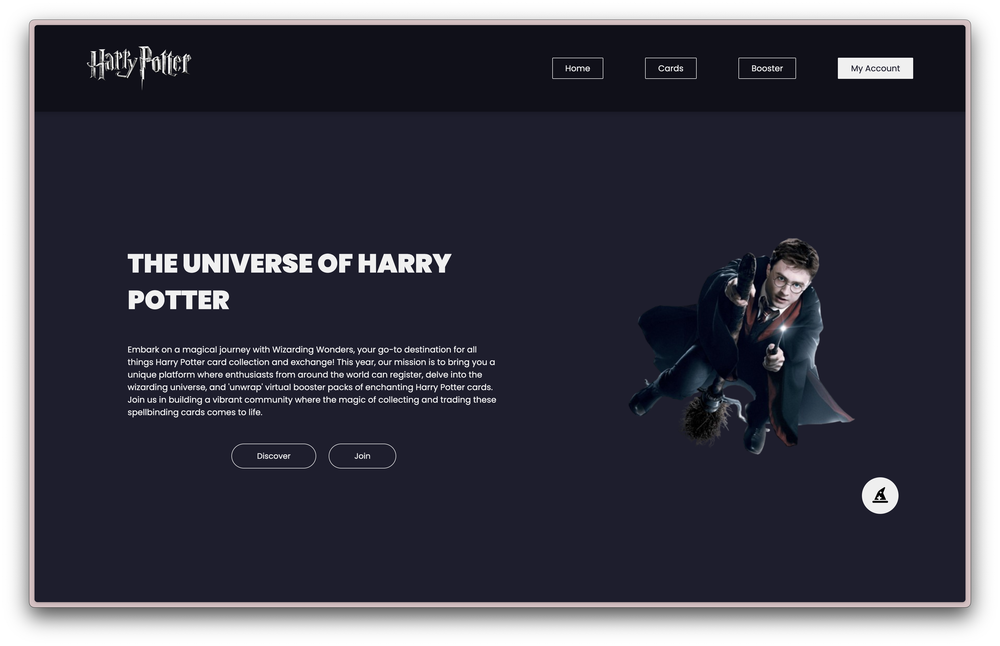

# IIMA1_Projet-dAxe

## Description
Ce projet est un projet de fin d'année nécessaire pour intégrer l'axe Coding et Digital Innovation de l'IIM Digital School. Il s'agit d'un site web sur le thème de **Harry Potter**, permettant aux utilisateurs de :
- **S'inscrire et se connecter** via un système d'authentification.
- **Collectionner des cartes** inspirées de l'univers de Harry Potter.
- **Échanger des cartes** avec d'autres utilisateurs pour compléter leur collection.

## Aperçu du site


## Technologies utilisées
- **Node.js**
- **Express**
- **Prisma**
- **MySQL** (via phpMyAdmin)
- **HTML**
- **CSS**
- **JavaScript**

## Installation
1. **Cloner le repository**
   ```bash
   git clone https://github.com/emoliie/IIMA1_Projet-dAxe.git
   ```
2. **Installer les dépendances**
   ```bash
   cd IIMA1_Projet-dAxe
   npm install
   ```
3. **Créer un fichier `.env`** à la racine du projet et y ajouter les variables suivantes :
   ```env
   PORT=3000
   DATABASE_URL=votre_url_de_base_de_donnees
   JWT_SECRET=votre_secret_jwt
   ```
4. **Générer le schéma Prisma**
   ```bash
   npx prisma generate
   ```
5. **Démarrer le serveur**
   ```bash
   npm start
   ```
6. **Ouvrir le projet Front-End**
   - Ouvrir le fichier HTML principal dans un navigateur en utilisant une extension comme **Live Server** sur VS Code ou en ouvrant le fichier directement.

## Fonctionnalités
- Création de compte et connexion sécurisée.
- Système de collection de cartes avec affichage dynamique.
- Échange de cartes entre utilisateurs.
- Interface inspirée de l'univers magique de Harry Potter.

## Auteur
**Emilie Xu**

---
N'hésitez pas à proposer des améliorations et à contribuer au projet ! 🪄✨
